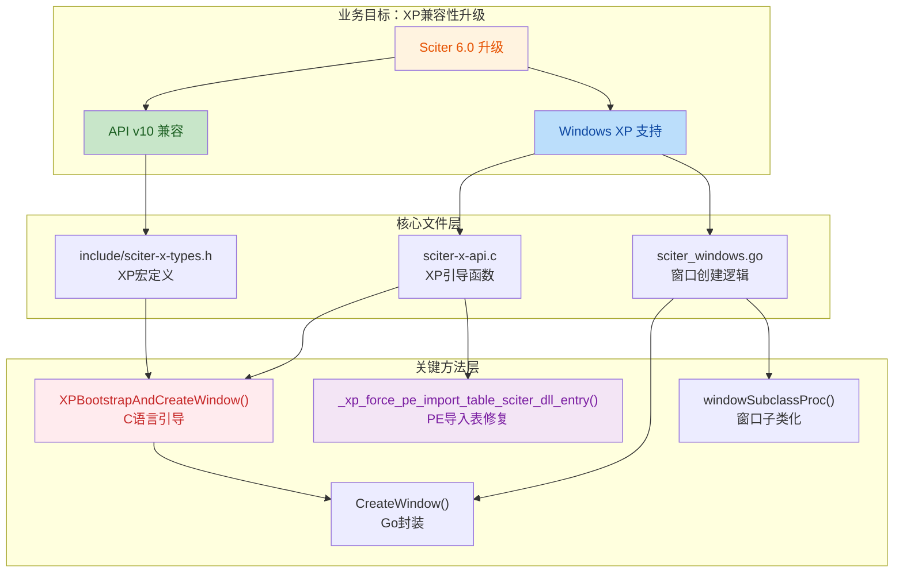
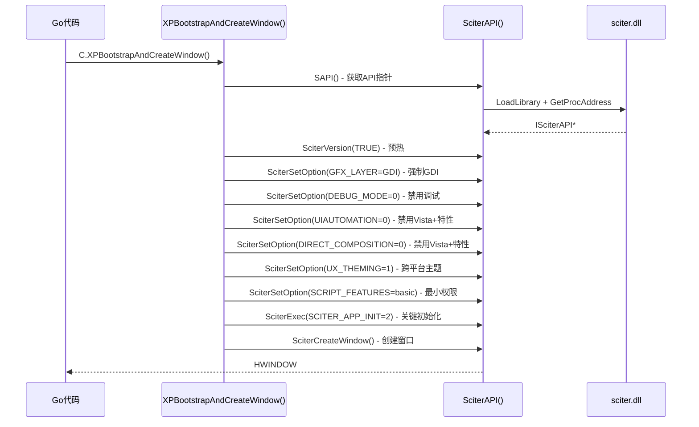
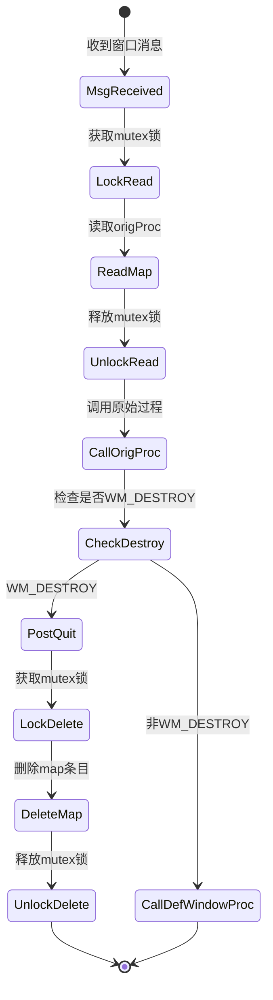

## 1. 高层摘要 (TL;DR)

- **影响范围**：🔴 **高** - 这是一个重大版本升级，涉及 API 版本从 v9 升级到 v10，并专门针对 Windows XP SP3 系统进行了深度兼容性修复
- **核心变更**：
  - 升级 Sciter 引擎版本至 6.0（API v10）
  - 实现了完整的 Windows XP SP3 兼容性支持
  - 修复了 XP 系统上的 DLL 加载多线程竞争问题
  - 修改了关键 API 函数签名（`SciterVersion`、`SciterCreateWindow`）
  - 重构了 Windows 窗口创建和消息处理机制

## 2. 可视化概览 (代码与逻辑映射)



## 3. 详细变更分析

### 3.1 核心头文件升级
#### 头文件还是使用include 目录下的文件,是修改后的头文件,include6 目录下的文件是Sciter 6.0版本的头文件，用于兼容Windows XP SP3
#### **include/sciter-x-api.h** - API 接口定义更新

- **API 版本升级**：`SCITER_API_VERSION` 从 v9 升级到 **v10**
- **函数签名变更**：
  - `SciterVersion(SBOOL major)` → `SciterVersion(UINT n)` - 返回版本向量 [v0,v1,v2,v3]
  - `SciterCreateWindow` 的第 3、4 个参数从 `SciterWindowDelegate* delegate, LPVOID delegateParam` 改为 `LPVOID, LPVOID`（保留参数，必须为 NULL）
- **平台特定函数**：移除了条件编译的 Direct2D 相关函数，改为统一的 `LPVOID` 占位符

#### **include/sciter-x-def.h** - 常量和结构体更新

- **新增通知类型**：`SC_SET_CURSOR (0x0A)` - 光标设置通知
- **结构体更新**：
  - `SCN_KEYBOARD_REQUEST` 的 `keyboardMode` 改为 `keyboardType`（Android 输入类型）
  - `SCN_DATA_LOADED` 新增 `requestId` 字段
- **代码风格**：统一了代码格式（缩进、换行）

#### **include/sciter-x-types.h** - 平台兼容性核心

- **XP SP3 宏定义**（关键变更）：
  ```c
  #ifndef _WIN32_WINNT
  #define _WIN32_WINNT 0x0501  // Windows XP
  #endif
  #ifndef WINVER
  #define WINVER 0x0501
  #endif
  #ifndef NTDDI_VERSION
  #define NTDDI_VERSION NTDDI_WINXPSP3
  #endif
  ```
- **C11 char16_t/char32_t 回退**：添加了三重条件保护，避免与编译器内置类型冲突
- **平台特定代码**：OSX、Linux、Android 平台的类型定义和结构体格式统一

### 3.2 Windows XP 兼容性核心实现

#### **sciter-x-api.c** - C 语言引导层（重大变更）

**新增关键函数**：

| 函数名 | 作用 | 关键技术 |
|--------|------|----------|
| `_xp_force_pe_import_table_sciter_dll_entry()` | 强制将 `sciter.dll` 加入 PE 导入表 | `__attribute__((used))` 防止链接器优化 |
| `_xp_static_import_works()` | 检测静态导入是否可用 | 检查 `&SciterAPI` 是否为 NULL |
| `_xp_show_sapi_diag()` | 显示诊断对话框（调试用） | 显示 DLL 路径、版本信息 |
| `XPBootstrapAndCreateWindow()` | **核心引导函数**，执行完整的 XP 初始化流程 | 纯 C 实现，避免 Go syscall 问题 |

**XPBootstrapAndCreateWindow() 执行流程**：


**关键技术点**：
- **PE 导入表修复**：通过 `extern __declspec(dllimport)` 声明 + `__attribute__((used))` 强制链接，确保 DLL 在 Go 运行时启动前加载，避免多线程 TLS 竞争
- **栈溢出防护**：使用 `static` 缓冲区代替栈上分配，避免 CGO 4KB 栈溢出
- **GDI 强制渲染**：`XPOPT_SET_GFX_LAYER=1` 绕过 Direct2D 初始化（XP 上不支持 D2D）

### 3.3 Go 语言层适配

#### **sciter.go** - 版本查询函数修正

```go
// 修正前：传递 SBOOL 类型
v = C.SciterVersion(C.SBOOL(1))

// 修正后：传递 UINT 类型
v = C.SciterVersion(C.UINT(1))
```

#### **sciter_windows.go** - 窗口创建重构

**变更前**：直接调用 `C.SciterCreateWindow()` 并传递 delegate 指针
**变更后**：调用 `C.XPBootstrapAndCreateWindow()`，delegate 参数强制为 0

```go
// 新增注释说明
// In Sciter API v10, the 3rd and 4th parameters (delegate/delegateParam) are reserved and MUST be NULL.

// 调用 C 语言引导函数
hwnd := C.XPBootstrapAndCreateWindow(
    C.UINT(createFlags),
    (*C.RECT)(pFrame),
    parent)
```

#### **sciter_darwin.go / sciter_linux.go** - 平台一致性

同样更新了 `CreateWindow()` 调用，将 delegate 和 delegateParam 强制设为 `nil`

### 3.4 窗口消息处理重构

#### **window/window_windows.go** - 子类化机制

**变更前**：使用 delegate 机制处理消息
**变更后**：使用窗口子类化（Subclassing）处理 `WM_DESTROY`

**新增数据结构**：
```go
var (
    windowProcMap   = make(map[win.HWND]uintptr)  // 存储 HWND -> 原始过程
    windowProcMutex sync.Mutex                     // 保护 map 访问
)
```

**关键死锁预防机制**（两条黄金规则）：

1. **规则 #1**（`New()` 函数中）：
   - `windowProcMutex` 仅保护 map 读写 + `GetWindowLongPtr`
   - **必须**在 `SetWindowLongPtr(GWLP_WNDPROC)` **之前解锁**
   - 原因：`SetWindowLongPtr` 可能发送消息，导致递归重入

2. **规则 #2**（`windowSubclassProc` 函数中）：
   - mutex 仅保护 map 读/写操作
   - **绝不能**持有 mutex 调用原始窗口过程或 `DefWindowProc`
   - 原因：`WM_PAINT` 等消息会触发递归调用，导致死锁

**消息处理流程**：


### 3.5 配置和文档变更

#### **.gitignore**
- 新增 `.trae/` 目录忽略（AI 工具目录）

#### **6版本兼容XP说明.md**（新文件）
- 说明头文件使用 `include/` 目录（修改后的头文件）
- `include6/` 目录存放 Sciter 6.0 原始头文件（用于 XP 兼容）

## 4. 影响与风险评估

### ⚠️ 破坏性变更

| 变更项 | 旧行为 | 新行为 | 兼容性影响 |
|--------|--------|--------|------------|
| `SciterVersion()` | `SciterVersion(SBOOL)` | `SciterVersion(UINT)` | **类型不兼容**，需修改调用代码 |
| `SciterCreateWindow()` | 接受 delegate 参数 | delegate 参数必须为 NULL | **完全破坏**，delegate 机制不再可用 |
| API 版本 | v9 | v10 | **ABI 不兼容**，需配套 Sciter 6.0 DLL |
| Windows 构建标志 | 无特殊标志 | 强制 `-lsciter` 链接 | **构建配置变更** |

### ✅ 兼容性改进

- **Windows XP SP3**：完全支持，修复了 TLS 竞争和 D2D 崩溃问题
- **现代 Windows**：无影响，GDI 渲染在所有 Windows 版本都可用
- **macOS/Linux**：API v10 保持向前兼容

### 🔍 测试建议

1. **XP 系统测试**：
   - 验证 DLL 加载时无崩溃（检查 PE 导入表）
   - 测试窗口创建和消息循环
   - 验证 `WM_DESTROY` 正确触发 `PostQuitMessage`

2. **现代系统测试**：
   - 确认 GDI 渲染性能可接受
   - 验证所有 Sciter API 功能正常

3. **并发压力测试**：
   - 多线程创建/销毁窗口
   - 验证 `windowProcMap` 无内存泄漏
   - 检查死锁场景（尤其是 `windowSubclassProc`）

4. **回归测试**：
   - 所有使用 `delegate` 的代码必须移除
   - `Version(true/false)` 调用改为 `Version(0/1/2/3)`

### 📊 API 变更对照表

| API 函数 | 参数变更 | 返回值变更 | 备注 |
|----------|----------|------------|------|
| `SciterVersion` | `SBOOL major` → `UINT n` | 无 | n=0..3 对应版本向量 |
| `SciterCreateWindow` | 第3、4参数改为保留 | 无 | 必须传 NULL |
| `SciterDataReadyAsync` | 无变化 | 无 | |
| 新增 `SC_SET_CURSOR` 通知 | - | - | 光标设置通知 |